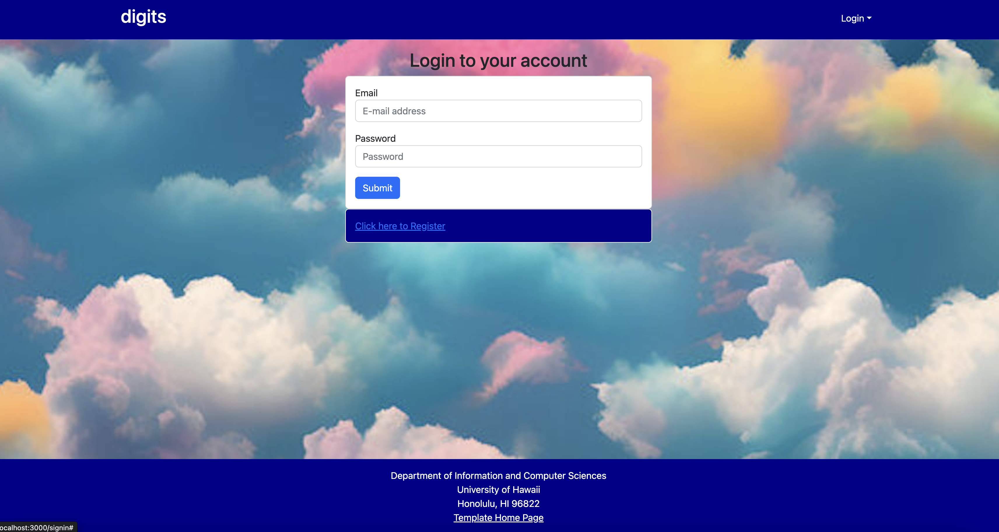
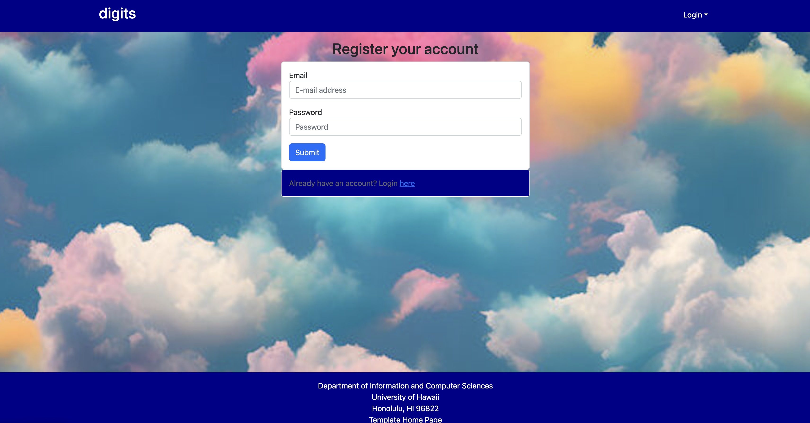
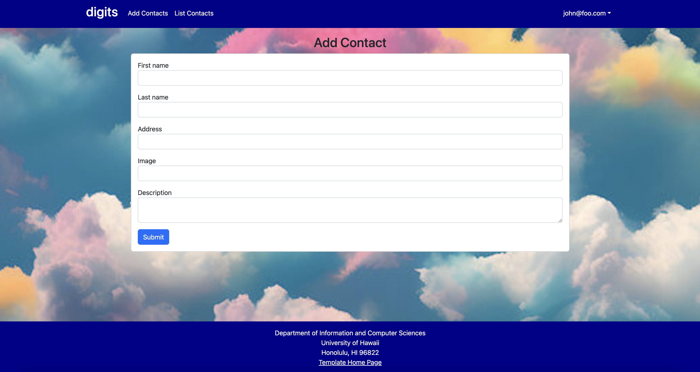
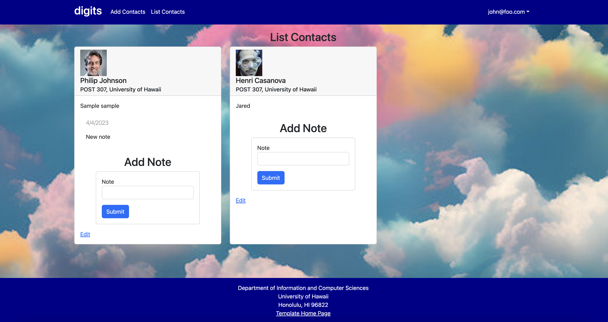
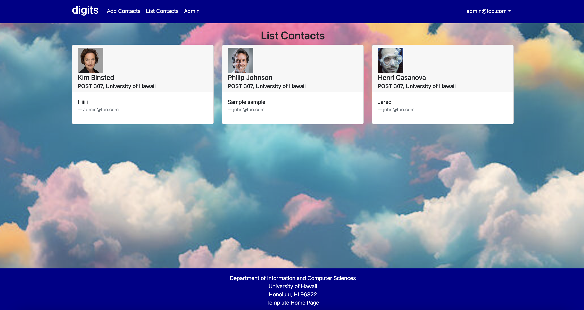

digits is a simple application where you can register an account, manage contacts, add notes, and list contacts. It includes:

  * A standard directory layout using 'imports/' as recommended in the [Meteor Guide](https://guide.meteor.com/structure.html)
  * [Bootstrap 5 React](https://react-bootstrap.github.io/) for user interface.
  * [Uniforms](https://uniforms.tools/) for form development.
  * [alanning:roles](https://github.com/alanning/meteor-roles) to implement a special "Admin" user.
  * Authorization, authentication, and registration using built-in Meteor packages.
  * Initialization of users and data from a settings file.
  * Alerts regarding success or failure of DB updates using [Sweet Alert](https://sweetalert.js.org/).
  * Quality assurance using [ESLint](http://eslint.org) with packages to partially enforce the [Meteor Coding Standards](https://guide.meteor.com/code-style.html) and the [AirBnB Javascript Style Guide](https://github.com/airbnb/javascript).


## Installation

First, [install Meteor](https://www.meteor.com/install).

Click the "Use this template" button at the top of this repository. Complete the dialog box to create a new repository that you own with this project's files.

Open the repository using IntelliJ or an IDE of your choice, then cd into the app/ directory of your local copy of the repo, and install third party libraries with:

```
$ meteor npm install
```

## Running the system

Once the libraries are installed, you can run the application by invoking the "start" script in the [package.json file](https://github.com/ics-software-engineering/meteor-application-template-react/blob/master/app/package.json):

```
$ meteor npm run start
```

### Viewing the running app

If all goes well, the template application will appear at [http://localhost:3000](http://localhost:3000).  You can login using the credentials in [settings.development.json](https://github.com/ics-software-engineering/meteor-application-template-react/blob/main/config/settings.development.json), or else register a new account.

## Walkthrough

The following sections describe the major features of this app.

#### Landing page

When you retrieve the app at http://localhost:3000, this is what should be displayed:


The next step is to use the Login menu to either Login to an existing account or register a new account.

#### Login page

Clicking on the Login link, then on the Sign In menu item displays this page:



#### Register page

Alternatively, clicking on the Login link, then on the Sign Up menu item displays this page:




#### Landing (after Login) page, non-Admin user

Once you log in (either to an existing account or by creating a new one), the navbar changes as follows:


You can now add new Contacts documents, add new Notes, and list the Contacts you have created. Note you cannot see any Stuff created by other users.

#### Add Contacts page

After logging in, here is the page that allows you to add new Contacts:



It also allows you to add timestamped-notes on each contact that you have.

#### List Contacts page

After logging in, here is the page that allows you to list all the Contacts you have created:



#### Landing (after Login), Admin user

You can define an "admin" user in the settings.json file. This user, after logging in, gets a special entry in the navbar:


#### Admin page (list all users stuff)

To provide a simple example of a "super power" for Admin users, the Admin page lists all of the Contacts by all of the users:



Note that non-admin users cannot get to this page, even if they type in the URL by hand.

